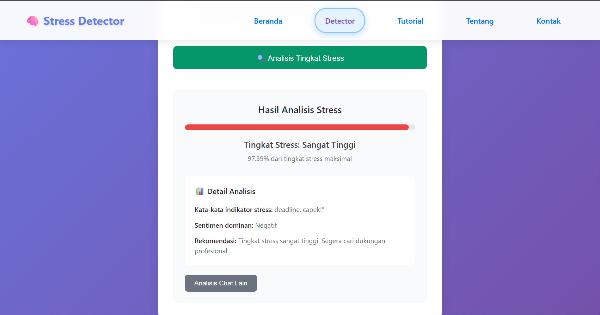

    

# Stress Chat Detector
Sebuah aplikasi untuk deteksi stress yang dapat membantu individu mengenali stress berdasarkan analisis chat.

## Dokumentasi
[Frontend](https://github.com/capstone-project-analisis-sentiment/deteksi-stress-dengan-analisis-chat-dan-sentiment/tree/main/Frontend)

[Backend](https://github.com/capstone-project-analisis-sentiment/deteksi-stress-dengan-analisis-chat-dan-sentiment/tree/main/Backend)

[Machine Learning](https://github.com/capstone-project-analisis-sentiment/deteksi-stress-dengan-analisis-chat-dan-sentiment/tree/main/Machine-Learning)

## Penggunaan
- anda akan melihat tampilan utama setelah buka web analisis stress 

- setelah tampil halaman utama selanjutnya klik menu detector untuk analisis tingkat stress  

- selanjutnya silakan upload screenshot yang ingin di prediksi lalu tekan analisis tingkat stress 

- Dan ini hasil analisisnya  

## produk kami
Buka sekarang web kami untuk informasi lebih lanjut [Stress Chat Detector](https://stress-chat-detector.vercel.app/)  

## Tim Kami
| Name              | University                             | Student ID    | Learning Path      |
|-------------------|----------------------------------------|---------------|--------------------|
| Rizaki Akbar      | Universitas Islam Kebangsaan Indonesia | MC436D5Y0920  | Machine Learning   |
| Agni Musadad      | Universitas Siliwangi                  | MC313D5Y2297  | Machine Learning   |
| Mansur            | Universitas Abulyatama                 | MC423D5Y2006  | Machine Learning   |
| Kuinsi Manda Aulia Hutasoit  | Politeknik Baja Tegal       | FC796D5X0086  | Frontend & Backend |
| Aulia Annisa      | Politeknik Baja Tegal                  | FC796D5X0097  | Frontend & Backend |
| Firani Nur Anjani | Politeknik Baja Tegal                  | FC796D5X0082  | Frontend & Backend |
